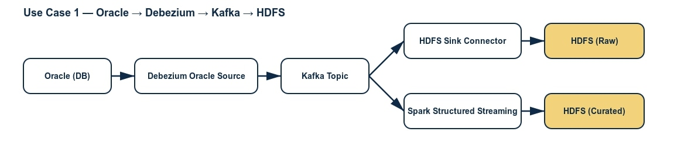

# Oracle CDC → Kafka → HDFS/Hive

## 📖 Overview
This project demonstrates an **CDC pipeline** from Oracle Database into Cloudera Data Platform.  
The pipeline uses **Debezium Oracle Source Connector** to capture CDC events, streams data into **Kafka**, and then processes the stream with **Spark Structured Streaming** into **HDFS** with partitioned storage.

---

## 🏗 Architecture


**Flow:**
1. **Oracle DB** → transactional source.  
2. **Debezium Oracle Source Connector** → captures CDC logs.  
3. **Kafka** (secured with Kerberos & TLS) → event streaming backbone.  
4. **Spark Structured Streaming** → consumes Kafka topics and writes partitioned files to HDFS.  
5. **HDFS & Hive** → raw and curated zones for analytics.  

---

## 🛠 Tech Stack
- Oracle Database  
- Debezium Oracle Connector  
- Apache Kafka (Kerberos + TLS secured)  
- Apache Spark 3 Structured Streaming  
- HDFS + Hive (Cloudera CDP)  
- Ranger for access control  

---

## ⚡ Key Features
- Real-time change capture from Oracle CDC.  
- Secure Kafka communication (Kerberos + TLS).  
- Partitioned HDFS storage by **date** and **hour**.  
- Integration with Hive for downstream analytics.  
- Includes working Spark consumer code.  

---

## 📂 Repository Structure
```text
oracle-cdc-kafka-hdfs/
├── README.md
├── images/
│   └── ora_debezium_hdfs.png
├── kafka_spark_consumer.py
├── configs/
│   ├── oracle-cdc.json
│   └── hdfs-sink.json
├── sample_data/
│   └── transactions_raw.jsonl
│   └── transactions_curated.json
└── notebooks/
    └── UC1_Panduan_enterprise.ipynb
```

---

## 🚀 Components

### 🔹 Kafka Spark Consumer
[`kafka_spark_consumer.py`](kafka_spark_consumer.py)  
Reads messages from Kafka topic and writes partitioned Parquet files to HDFS.  

```python
# Example snippet from consumer
df_partitioned = (df_parsed
    .withColumn("dt", to_date(col("timestamp")))
    .withColumn("hour", date_format(col("timestamp"), "HH"))
)
```
---

## 🔹 Sample Data

Example preview:

| id | name    | timestamp           |
|----|---------|---------------------|
| 1  | Alice   | 2025-09-01 10:00:00 |
| 2  | Bob     | 2025-09-01 10:05:00 |
| 3  | Charlie | 2025-09-01 10:10:00 |

Full sample available in:
- [`transactions_raw.jsonl`](sample_data/transactions_raw.jsonl) → Debezium CDC raw events (JSON Lines).
- [`transactions_curated.json`](sample_data/transactions_curated.json) → Curated output after Spark Structured Streaming.


---

## 📊 Example Hive Query
```sql
SELECT name, COUNT(*) AS txn_count
FROM hive.curated.transactions
WHERE dt = '2025-09-01'
GROUP BY name
ORDER BY txn_count DESC;
```

